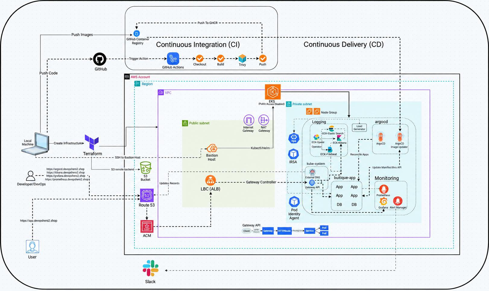

# Production-Grade GitOps-Driven Microservices on AWS EKS

## 1. What This Project Is

This project is a production-grade, GitOps-driven deployment of an enterprise 11-tier microservices application (Online Boutique) running on Amazon Elastic Kubernetes Service (AWS EKS). It demonstrates modern cloud-native DevOps practices by combining Infrastructure as Code (IaC), GitOps continuous delivery, automated container build pipelines, automated image version management, advanced networking via the Kubernetes Gateway API, dynamic DNS automation, full-stack observability, and automated scaling.

### Core Stack & Capabilities
- **Infrastructure as Code (IaC):** Modular AWS infrastructure provisioned with **Terraform**, including a customized multi-AZ VPC, private and public subnets, a dedicated Bastion Host, and a managed AWS EKS cluster.
- **Application Architecture:** Online Boutique 11-tier microservices application communicating internally over high-performance gRPC (Frontend, Cart, Product Catalog, Currency, Payment, Shipping, Email, Checkout, Recommendation, Ad, and Load Generator services).
- **Next-Gen Ingress & Networking:** **Kubernetes Gateway API** managed by the **AWS Load Balancer Controller (LBC)** with AWS Application Load Balancers (ALBs) and automated ACM TLS certificate termination for `*.devopshero2.shop`.
- **Dynamic DNS Automation:** **ExternalDNS** integrated via **AWS EKS Pod Identity** to automatically discover Gateway API HTTPRoutes and manage DNS records in Amazon Route 53.
- **GitOps Continuous Delivery:** **ArgoCD** integrated with **Kustomize** and **Helm** (using the *Kustomize Helm-chart pattern* to decouple infrastructure routes from application packaging).
- **Automated Image Updates:** **Argo CD Image Updater** tracking GitHub Container Registry (GHCR) and automatically updating container tags directly in Git using a GitOps pull-based loop.
- **Continuous Integration (CI):** **GitHub Actions** multi-service matrix pipeline with automated change detection, Docker Buildx caching, Trivy vulnerability security scanning, and pushing signed images to GHCR.
- **Observability (Monitoring & Alerting):** **Kube-Prometheus-Stack** (Prometheus & Grafana) with pre-configured Kubernetes dashboards, metric drilldowns, and automated Slack alert notifications.
- **Observability (Centralized Logging):** **Elastic Cloud on Kubernetes (ECK)** running Elasticsearch with Amazon EBS CSI storage volumes, Filebeat log collection across all pods and nodes, and Kibana dashboards.
- **Autoscaling & Resilience:** Kubernetes **Metrics Server** and **Horizontal Pod Autoscaler (HPA)** automatically scaling workloads based on live CPU utilization and real-world traffic generated by Locust.

---

## 2. Architecture Diagram



---

## 3. Implementation Steps

### Step 1: Infrastructure Provisioning with Terraform

- **`Terraform-EC2/`** — VPC, subnets, and the bastion host. Rarely destroyed; just stop/start the EC2 instance from the AWS console when idle.
- **`Terraform-EKS/`** — the EKS cluster and node group. Reads the VPC/bastion details from `Terraform-EC2`'s remote state instead of owning them, so it can be destroyed and recreated daily without affecting the other stack.

Both stacks require a shared S3 backend (this is now mandatory, not optional — `Terraform-EKS` depends on being able to read `Terraform-EC2`'s state via `terraform_remote_state`).

1. Create the shared S3 bucket used by both stacks (one bucket, two state file keys: `ec2/terraform.tfstate` and `eks/terraform.tfstate`):
   ```bash
   aws s3api create-bucket \
     --bucket <YOUR_TERRAFORM_BACKEND_BUCKET> \
     --region us-east-1

   aws s3api put-bucket-versioning \
     --bucket <YOUR_TERRAFORM_BACKEND_BUCKET> \
     --versioning-configuration Status=Enabled

   aws s3api put-bucket-encryption \
     --bucket <YOUR_TERRAFORM_BACKEND_BUCKET> \
     --server-side-encryption-configuration '{
       "Rules":[{
         "ApplyServerSideEncryptionByDefault":{
           "SSEAlgorithm":"AES256"
         }
       }]
     }'
   ```
   Replace `<YOUR_TERRAFORM_BACKEND_BUCKET>` in `Terraform-EC2/terraform.tf`, `Terraform-EKS/terraform.tf`, and `Terraform-EKS/remote_state.tf` with your actual bucket name. State locking uses S3's native lockfile support (`use_lockfile = true`) — no DynamoDB table needed.

2. Provision the network and bastion first (`Terraform-EKS` depends on this stack's outputs):
   ```bash
   cd Terraform-EC2/
   terraform init
   terraform plan
   terraform apply -auto-approve
   ```
   *Outputs will display the VPC ID and Bastion host public IP. An SSH private key (`mj-bastion-key.pem`) will be generated in this directory.*

3. Provision the EKS cluster (must run after Step 1.2, since it reads the VPC ID, private subnets, and bastion security group from `Terraform-EC2`'s remote state):
   ```bash
   cd ../Terraform-EKS/
   terraform init
   terraform plan
   terraform apply -auto-approve
   ```
   *Output will display the EKS cluster name.*

---

### Step 2: Bastion Host Configuration & Cluster Access

1. SSH into the Bastion host:
   ```bash
   chmod 400 mj-bastion-key.pem
   ssh -i mj-bastion-key.pem ubuntu@<BASTION_PUBLIC_IP>
   ```

2. Install the required DevOps CLI tools:
   - **AWS CLI v2**
   - **kubectl**
   - **Helm v3**
   - **eksctl**

3. Configure AWS credentials and update kubeconfig:
   ```bash
   aws configure
   aws eks update-kubeconfig --region us-east-1 --name mj-cluster
   ```

4. Verify cluster connectivity:
   ```bash
   kubectl get nodes
   ```

---

### Step 3: AWS Load Balancer Controller Installation

1. Associate the IAM OIDC Provider:
   ```bash
   eksctl utils associate-iam-oidc-provider \
     --region us-east-1 \
     --cluster mj-cluster \
     --approve
   ```

2. Create the IAM policy for the AWS Load Balancer Controller:
   ```bash
   curl -O https://raw.githubusercontent.com/kubernetes-sigs/aws-load-balancer-controller/v2.14.1/docs/install/iam_policy.json

   aws iam create-policy \
     --policy-name AWSLoadBalancerControllerIAMPolicy \
     --policy-document file://iam_policy.json
   ```

3. Create the IAM Service Account:
   ```bash
   eksctl create iamserviceaccount \
     --cluster=mj-cluster \
     --namespace=kube-system \
     --name=aws-load-balancer-controller \
     --attach-policy-arn=arn:aws:iam::<AWS_ACCOUNT_ID>:policy/AWSLoadBalancerControllerIAMPolicy \
     --override-existing-serviceaccounts \
     --region us-east-1 \
     --approve
   ```

4. Install the AWS Load Balancer Controller using Helm with Gateway API feature gates enabled:
   ```bash
   helm repo add eks https://aws.github.io/eks-charts
   helm repo update eks

   helm upgrade -i aws-load-balancer-controller eks/aws-load-balancer-controller \
     -n kube-system \
     --set clusterName=mj-cluster \
     --set region=us-east-1 \
     --set vpcId=<YOUR_VPC_ID> \
     --set serviceAccount.create=false \
     --set serviceAccount.name=aws-load-balancer-controller \
     --set controllerConfig.featureGates.NLBGatewayAPI=true \
     --set controllerConfig.featureGates.ALBGatewayAPI=true \
     --version 3.0.0
   ```

5. Verify controller deployment:
   ```bash
   kubectl get deployment -n kube-system aws-load-balancer-controller
   ```

---

### Step 4: Kubernetes Gateway API & ALB Gateway Deployment

1. Install the official Gateway API CRDs:
   ```bash
   # Standard Gateway API CRDs
   kubectl apply -f https://github.com/kubernetes-sigs/gateway-api/releases/download/v1.3.0/standard-install.yaml

   # AWS Load Balancer Controller Gateway API CRDs
   kubectl apply -f https://raw.githubusercontent.com/kubernetes-sigs/aws-load-balancer-controller/refs/heads/main/config/crd/gateway/gateway-crds.yaml
   ```

2. Deploy the `GatewayClass`:
   ```bash
   kubectl apply -f gateway-api-manifests/gateway-class.yaml
   ```

3. Configure the `LoadBalancerConfiguration` with your ACM Certificate ARN in `gateway-api-manifests/alb-config.yaml`:
   ```yaml
   apiVersion: gateway.k8s.aws/v1beta1
   kind: LoadBalancerConfiguration
   metadata:
     name: app-gw-lbconfig
     namespace: default
   spec:
     scheme: internet-facing
     listenerConfigurations:
       - protocolPort: HTTPS:443
         defaultCertificate: arn:aws:acm:us-east-1:<AWS_ACCOUNT_ID>:certificate/<CERTIFICATE_ID>
   ```
   Apply:
   ```bash
   kubectl apply -f gateway-api-manifests/alb-config.yaml
   ```

4. Deploy the internet-facing `Gateway` (`gateway-api-manifests/gateway.yaml`):
   ```yaml
   apiVersion: gateway.networking.k8s.io/v1beta1
   kind: Gateway
   metadata:
     name: app-alb-gateway
     namespace: default
   spec:
     gatewayClassName: aws-alb-gateway-class
     infrastructure:
       parametersRef:
         kind: LoadBalancerConfiguration
         name: app-gw-lbconfig
         group: gateway.k8s.aws
     listeners:
     - name: http
       protocol: HTTP
       port: 80
       hostname: "*.devopshero2.shop"
       allowedRoutes:
         namespaces:
           from: All
     - name: https
       protocol: HTTPS
       hostname: "*.devopshero2.shop"
       port: 443
       allowedRoutes:
         namespaces:
           from: All
   ```
   Apply and verify:
   ```bash
   kubectl apply -f gateway-api-manifests/gateway.yaml
   kubectl get gateway
   ```

---

### Step 5: ExternalDNS Setup with EKS Pod Identity

1. Create Route 53 IAM Policy:
   ```bash
   aws iam create-policy \
     --policy-name AllowExternalDNSUpdates \
     --policy-document file://external-dns/policy.json
   ```

2. Create the `external-dns` namespace and link permissions using **EKS Pod Identity**:
   ```bash
   kubectl create ns external-dns

   export POLICY_ARN=$(aws iam list-policies --query 'Policies[?PolicyName==`AllowExternalDNSUpdates`].Arn' --output text)

   eksctl create podidentityassociation \
     --cluster mj-cluster \
     --namespace external-dns \
     --service-account-name external-dns \
     --role-name external-dns-pod-identity-role \
     --permission-policy-arns $POLICY_ARN
   ```

3. Deploy ExternalDNS with Gateway API route discovery enabled:
   ```bash
   helm repo add external-dns https://kubernetes-sigs.github.io/external-dns/
   helm repo update

   helm upgrade -i external-dns external-dns/external-dns \
     -f external-dns/external-dns-values-1.20.0.yaml \
     -n external-dns \
     --version 1.20.0
   ```

4. Verify ExternalDNS pod is running:
   ```bash
   kubectl get pods -n external-dns
   ```

---

### Step 6: Deploy ArgoCD with Gateway API

1. Add the Argo Helm repository:
   ```bash
   helm repo add argo https://argoproj.github.io/argo-helm
   helm repo update
   ```

2. Deploy ArgoCD using `argocd/argocd-values-9.4.0.yaml`:
   - Configured with `server.insecure: true` (TLS terminated at ALB).
   - Configured with `kustomize.buildOptions: "--enable-helm"`.
   - Exposes `argocd.devopshero2.shop` via Gateway API HTTPRoute.

   ```bash
   helm install argo-cd argo/argo-cd \
     -n argocd \
     -f argocd/argocd-values-9.4.0.yaml \
     --version 9.4.0 \
     --create-namespace
   ```

3. Apply TargetGroupConfiguration for ArgoCD:
   ```bash
   kubectl apply -f argocd/target-grp-config.yaml
   ```

4. Retrieve the initial admin password:
   ```bash
   kubectl -n argocd get secret argocd-initial-admin-secret -o jsonpath="{.data.password}" | base64 -d && echo
   ```
   Access ArgoCD in browser: `https://argocd.devopshero2.shop` (User: `admin`).

---

### Step 7: Continuous Integration (CI) with GitHub Actions & GHCR

The CI pipeline is structured across two workflows inside `.github/workflows/`:

1. **`ci-trigger.yaml`**: Detects changes under `src/**` on commits to `main` and dispatches builds dynamically per modified microservice.
2. **`microservice-ci.yaml`**: Reusable workflow that:
   - Sets up Docker Buildx with GitHub Actions layer caching.
   - Builds container image tagged with `sha-<COMMIT_HASH>`.
   - Executes **Trivy security scan** for HIGH and CRITICAL vulnerabilities.
   - Pushes verified images to GitHub Container Registry (`ghcr.io`).

Ensure GitHub repository settings grant **Read and Write permissions** for GitHub Packages under `Settings -> Actions -> General -> Workflow permissions`.

---

### Step 8: GitOps Continuous Delivery (CD) with ArgoCD & Kustomize

1. Verify `kustomization.yaml` at the project root connects the Helm chart and infrastructure HTTPRoutes:
   ```yaml
   apiVersion: kustomize.config.k8s.io/v1beta1
   kind: Kustomization

   resources:
     - microservices-extra-kube-manifests/HTTProute.yaml
     - microservices-extra-kube-manifests/target-grp.yaml

   helmCharts:
     - name: onlineboutique
       repo: oci://ghcr.io/<YOUR_GITHUB_USERNAME>
       version: 0.10.4
       releaseName: boutique-app
       namespace: boutique-app
       valuesFile: helm-chart/values.yaml
   ```

2. Update `argocd/argocd-apps/boutique-app.yaml` with your repository URL and apply:
   ```bash
   kubectl apply -f argocd/argocd-apps/boutique-app.yaml
   ```

3. Verify the application sync in the ArgoCD UI or via CLI:
   ```bash
   kubectl get pods -n boutique-app
   kubectl get httproute -n boutique-app
   ```
   Access Online Boutique: `https://app.devopshero2.shop`

---

### Step 9: Automated Container Image Promotion with ArgoCD Image Updater

1. Install Argo CD Image Updater:
   ```bash
   helm upgrade -i argo-image-updater argo/argocd-image-updater \
     -n argocd \
     -f argocd/argo-image-updater-values-1.0.5.yaml \
     --version 1.0.5
   ```

2. Apply the ImageUpdater custom resource (`argocd/image-updater.yaml`):
   ```bash
   kubectl apply -f argocd/image-updater.yaml
   ```

3. Verify Image Updater status:
   ```bash
   kubectl get imageupdater -n argocd
   ```
   *When new container image tags matching `^sha-[a-f0-9]{7,40}$` are pushed by GitHub Actions, ArgoCD Image Updater automatically commits the updated tag to Git, triggering immediate rollout.*

---

### Step 10: Observability Stack Setup

#### 10.1 Monitoring with Kube-Prometheus-Stack & Slack Alerts
1. Create a Kubernetes secret for Slack alerting webhook:
   ```bash
   kubectl create namespace monitoring
   kubectl create secret generic alertmanager-slack-webhook \
     --from-literal=url='<YOUR_SLACK_WEBHOOK_URL>' \
     -n monitoring
   ```

2. Add Prometheus Community Helm repo and install:
   ```bash
   helm repo add prometheus-community https://prometheus-community.github.io/helm-charts
   helm repo update

   helm upgrade -i kube-prometheus-stack prometheus-community/kube-prometheus-stack \
     -n monitoring \
     -f observability/helm-values/kube-prom-stack-81.6.3.yaml \
     --version 81.6.3
   ```

3. Expose Grafana and Prometheus via Gateway API:
   ```bash
   kubectl apply -f observability/HTTProute-grafana.yaml
   kubectl apply -f observability/target-grp-grafana.yaml

   kubectl apply -f observability/HTTProute-prometheus.yaml
   kubectl apply -f observability/target-grp-prometheus.yaml
   ```

4. Retrieve Grafana admin password:
   ```bash
   kubectl --namespace monitoring get secrets kube-prometheus-stack-grafana -o jsonpath="{.data.admin-password}" | base64 -d && echo
   ```
   - **Grafana:** `https://grafana.devopshero2.shop`
   - **Prometheus:** `https://prometheus.devopshero2.shop`

#### 10.2 Centralized Logging with ECK, Filebeat & Kibana
1. Add AWS EBS CSI driver addon for persistent Elasticsearch storage:
   ```bash
   eksctl create iamserviceaccount \
     --cluster mj-cluster \
     --namespace kube-system \
     --name ebs-csi-controller-sa \
     --attach-policy-arn arn:aws:iam::aws:policy/service-role/AmazonEBSCSIDriverPolicy \
     --override-existing-serviceaccounts \
     --approve

   eksctl create addon \
     --cluster mj-cluster \
     --name aws-ebs-csi-driver \
     --version latest \
     --force
   ```

2. Apply the EBS StorageClass:
   ```bash
   kubectl apply -f observability/storageclass.yaml
   ```

3. Install the Elastic Cloud on Kubernetes (ECK) operator:
   ```bash
   helm repo add elastic https://helm.elastic.co
   helm repo update

   helm upgrade -i elastic-operator elastic/eck-operator \
     -n elastic-system \
     --create-namespace \
     --version 2.14.0
   ```

4. Deploy Elasticsearch and Kibana:
   ```bash
   kubectl create ns logging

   helm upgrade -i eck-kibana elastic/eck-kibana \
     -n logging \
     -f observability/helm-values/eck-kibana-0.18.0.yaml \
     --version 0.18.0
   ```

5. Deploy Filebeat to collect logs across all nodes:
   ```bash
   helm upgrade -i eck-beats elastic/eck-beats \
     -n logging \
     -f observability/helm-values/eck-beats-0.18.0.yaml \
     --version 0.18.0
   ```

6. Expose Kibana via Gateway API:
   ```bash
   kubectl apply -f observability/HTTProute-kibana.yaml
   kubectl apply -f observability/target-grp-kibana.yaml
   ```

7. Retrieve the `elastic` user password:
   ```bash
   kubectl get secret eck-elasticsearch-es-elastic-user -n logging -o go-template='{{.data.elastic | base64decode}}' && echo
   ```
   - **Kibana UI:** `https://kibana.devopshero2.shop`

---

### Step 11: Scaling & Reliability

1. Install the Kubernetes Metrics Server:
   ```bash
   helm repo add metrics-server https://kubernetes-sigs.github.io/metrics-server/
   helm repo update

   helm upgrade -i metrics-server metrics-server/metrics-server \
     -n kube-system \
     --set args={--kubelet-insecure-tls}
   ```

2. Verify node metrics are reporting:
   ```bash
   kubectl top nodes
   kubectl top pods -n boutique-app
   ```

3. Deploy Horizontal Pod Autoscaler (HPA) for frontend:
   ```bash
   kubectl apply -f scaling/frontend-hpa.yaml
   ```

4. Monitor live autoscaling under load:
   ```bash
   kubectl get hpa -n boutique-app --watch
   ```

---

### Step 12: Resource Cleanup & Teardown

To avoid incurring cloud provider charges, tear down resources in the following reverse order:

1. Delete ArgoCD applications and workloads:
   ```bash
   kubectl delete -f argocd/argocd-apps/boutique-app.yaml
   kubectl delete -f argocd/image-updater.yaml
   ```

2. Delete Gateway API and HTTPRoute resources:
   ```bash
   kubectl delete -f observability/HTTProute-kibana.yaml
   kubectl delete -f observability/target-grp-kibana.yaml
   kubectl delete -f observability/HTTProute-grafana.yaml
   kubectl delete -f observability/target-grp-grafana.yaml
   kubectl delete -f observability/HTTProute-prometheus.yaml
   kubectl delete -f observability/target-grp-prometheus.yaml
   kubectl delete -f microservices-extra-kube-manifests/HTTProute.yaml
   kubectl delete -f microservices-extra-kube-manifests/target-grp.yaml
   kubectl delete -f gateway-api-manifests/gateway.yaml
   kubectl delete -f gateway-api-manifests/alb-config.yaml
   kubectl delete -f gateway-api-manifests/gateway-class.yaml
   ```

3. Uninstall Helm charts:
   ```bash
   helm uninstall eck-beats -n logging
   helm uninstall eck-kibana -n logging
   helm uninstall elastic-operator -n elastic-system
   helm uninstall kube-prometheus-stack -n monitoring
   helm uninstall argo-image-updater -n argocd
   helm uninstall argo-cd -n argocd
   helm uninstall external-dns -n external-dns
   helm uninstall aws-load-balancer-controller -n kube-system
   helm uninstall metrics-server -n kube-system
   ```

4. Destroy AWS infrastructure via Terraform — **EKS first, then EC2** (`Terraform-EKS` reads `Terraform-EC2`'s remote state, so the EC2 stack must still exist while EKS is being destroyed):
   ```bash
   cd Terraform-EKS/
   terraform destroy -auto-approve

   cd ../Terraform-EC2/
   terraform destroy -auto-approve
   ```

   *Day-to-day cost saving, without a full teardown:* the bastion (`Terraform-EC2`) can just be stopped from the AWS console/CLI instead of destroyed — it's cheap to leave stopped and its `.pem` key stays valid. The EKS control plane cannot be stopped, only destroyed, so if you're idling overnight it's normal to run only:
   ```bash
   cd Terraform-EKS/
   terraform destroy -auto-approve
   ```
   and recreate it the next day with `terraform apply -auto-approve` from `Terraform-EKS/` — the bastion, VPC, and CLI tools installed on the bastion are untouched, but everything installed *inside* the cluster (Steps 3–11) needs reinstalling, and `aws eks update-kubeconfig` must be re-run since the new cluster has a fresh endpoint/certificate.
